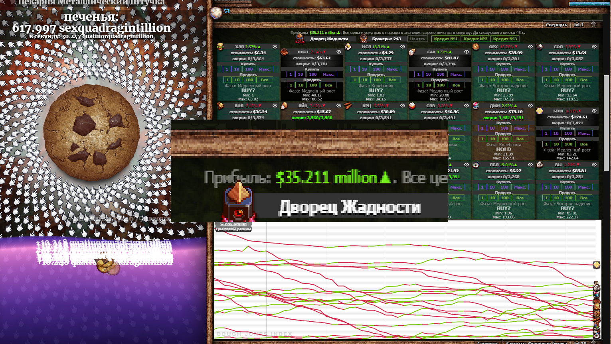

# Мод Auto Traider для Cookie Clicker



**Версия:** 6

Auto Traider — это мод для Cookie Clicker, который автоматизирует мини-игру «Stock Market». Он непрерывно анализирует движение цен, выявляет самые волатильные товары и исполняет ордера на покупку/продажу по вашим настраиваемым порогам. При желании можно включить отправку уведомлений в Telegram о ценах и сделках в реальном времени.

---

## 💡 Возможности

- **Автоматическая торговля**  
  Мод сам покупает и продаёт наиболее волатильные активы, опираясь на моменты, рассчитанные по вашим пороговым значениям и трейлинг-стопам.

- **Настраиваемые пороги**  
  - **Порог покупки**: покупка, когда цена ≤ опорного значения × порог.  
  - **Порог продажи**: частичная продажа, когда цена ≥ цены входа × порог.

- **Детекция импульса**  
  Покупка только после указанного числа подряд идущих ростов цены.

- **Трейлинг-стоп и частичные продажи**  
  Фиксация прибыли: сначала часть позиции продаётся по цели, а оставшаяся — при откате цены от пика.

- **Подсказки в UI**  
  На плитках активов отображаются фаза рынка, совет (`BUY?` / `HOLD`) и мин/макс недавней истории цен.

- **Принудительный анализ рынка**  
  Кнопка «Analyze Market» пересчитывает самые волатильные активы вручную.

- **Уведомления в Telegram**  
  Отправляйте обновления цен и информацию о сделках в ваш чат Telegram. Введите команду `/prices` в чате, чтобы получить актуальные цены по запросу.

---

## 🚀 Установка

1. **Скопируйте папку мода**  
   - Перейдите в корневую папку установки Cookie Clicker:  
     ```
     <путь_к_Steam>\SteamApps\common\Cookie Clicker\resources\app\mods\local
     ```  
   - Создайте в ней подпапку `auto-traider-mod-cookie-clicker` и поместите внутрь файлы:  
     - `main.js`  
     - `info.txt`

2. **Включите мод в игре**  
   - Запустите Cookie Clicker.  
   - Откройте **Options → Mods** (Настройки → Моды).  
   - Найдите «Auto Traider» и включите его (по умолчанию отключён).

---

## ⚙️ Настройка

| Параметр                 | Описание                                                        | Значение по умолчанию |
| ------------------------ | ---------------------------------------------------------------- | --------------------- |
| **Enabled**              | Включить/отключить мод                                          | `true`                |
| **Show Phases**          | Показывать фазу рынка (`Stable`, `Growth` и т. д.)               | `true`                |
| **Show Advice**          | Подсказки `BUY?` / `HOLD` на плитках                             | `true`                |
| **Show Details**         | Отображать мин/макс цен за недавний период                       | `true`                |
| **Buy Threshold**        | Порог покупки (коэффициент от опорной цены)                      | `0.95`                |
| **Sell Threshold**       | Порог частичной продажи (коэффициент от цены входа)              | `1.10`                |
| **Momentum Ticks**       | Число подряд ростов цены для покупки                             | `2`                   |
| **Trailing Stop %**      | Коэффициент для трейлинг-стопа от максимума                      | `0.98`                |
| **Partial Sell %**       | Доля позиции для первой части продажи                           | `0.50`                |
| **Top Assets Count**     | Сколько активов отслеживать (по волатильности)                   | `3`                   |
| **Analyze Interval**     | Интервал между автоматическим анализом (в тиках)                | `300`                 |
| **Telegram Alerts**      | Включить уведомления в Telegram                                  | `false`               |
| **Log Prices**           | Отправлять цены в Telegram                                       | `true`                |
| **Log Trades**           | Отправлять сделки в Telegram                                     | `true`                |
| **Show Log Window**      | Показывать лог действий прямо в игре                             | `false`               |

### 📱 Настройка Telegram

1. Включите **Telegram Alerts**.  
2. Введите **Bot Token** и **Chat ID**.  
3. Переключите **Log Prices** и **Log Trades** по желанию.  
4. В чате Telegram отправьте: /prices чтобы получить текущие цены «по требованию».

---

## 🎮 Использование

- Мод автоматически запускается при открытии мини-игры «Stock Market».  
- Для просмотра лога включите **Show Log Window** в настройках.  
- Ручной анализ топ-активов — кнопка **Analyze Market**.  
- На плитках активов следите за фазой, советом и историей цены.

---

## 🔗 Steam Workshop (устаревшая версия)

Легаси-версия в Steam Workshop:  
[Auto Traider Mod for Cookie Clicker (Old Version)](https://steamcommunity.com/sharedfiles/filedetails/?id=3520053496)

---

P.s.
В стиме новая версия не выкладывается по неизвестной мне причине. :(
